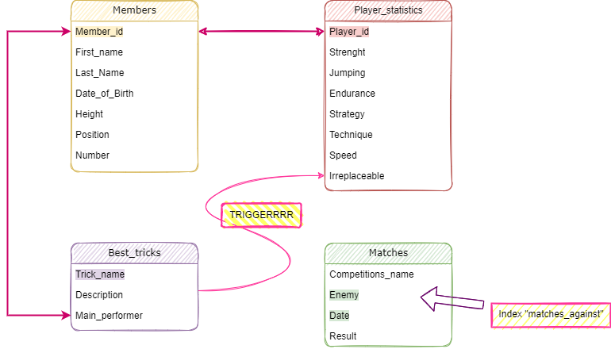

# Haikyuu!! Database

## Contributors:
**20SE-2**
* ***Golub Mary*** 
* ***Oleg Grigoryev***

#### Придумать свою предметную область и продумать схему БД для неё.
	
В качестве предметной области мы выбрали реализацию базы данных для волебольных школ. В качестве источника информации мы выбрали аниме "Волейбол".

Таблица Мembers хранит уникальный номер участников клуба (Member_id), их имя и фамилию (First_Name, Last_Name), дату рождения (Date_of_Birth), рост (Height), позиция на поле или роль в клубе в графе Position_ (кроме игроков в таблице могут быть тренеры и мененджеры) и номер игрока (у мененджеров и тренеров его может не быть) в графе Number_

В таблице Best_tricks записаны лучшие приемы, которые испльзует в своих матчах команда. Первичным ключом является название приема - Trick_name. Далее идет его описание (графа Description) и id главного исполнителя (Main_performer)

Так же, есть таблица Player_statistics со статистикой игроков, в которой один из столбцов (Irreplaceable), отвечающий за "незаменимость" игрока, связан триггером с таблицей Best_tricks. По умолчанию он равен 1, но при любом изменении, добавлении или удалении строк в таблице лучших трюков, значение "незаменимости" пересчитывается. Чем больше в таблице "супер-приемов", в которых игрок выступает в качестве главного исполнителя - тем больше будет у него показатель "незаменимости". Первичный ключ - id игрока.
Помимо этого в статистике есть: сила, прыжки, выносливость, стратегия, техника и скорость.

В поледней таблице находится информация о сыгранных матчах: название турнира (Competitions_name), соперник (Enemy), дата проведения игры (Date) и результат (Result).
По условиям проведения соревнований, играть с одним и тем же противником дважды в день запрещено. Поэтому первичный ключ в этой таблице составной - из столбцов Date и Enemy.

​

#### Критерии к БД:
**[1]** БД должна быть в третьей нормальной форме или выше;

* Все условия соблюдены. Все атрибуты зависят от первичного ключа целиком, а не от какой-то его части. 
* Все атрибуты зависят от первичного ключа, но не от других атрибутов
 
**[2]** Минимальное количество таблиц – четыре;

* Созданная база данных состоит из 4х таблиц 

**[3]** Все подключения из GUI должны осуществляться выделенным, не root, пользователем;

* Подключаемся с помощью пользователя «postgres», который был автоматически создан при установке:
####
      host = "localhost"
      user = "postgres"
      password = "12345"
      db_name = "karasuno"
      
####
      connection = psycopg2.connect( host=host, user=user, password=password, database=db_name)

**[4]** Должен существовать как минимум один индекс, 
    созданный вами по выбранному текстовому не ключевому полю;

* Объявляем индексом название команды-противника:
####
	CREATE INDEX matches_against On matches (enemy);

**[5]** В одной из таблиц должно присутствовать поле, заполняемое/изменяемое только триггером 
(например, «общая стоимость бронирования» в таблице «бронирования», которое автоматически 
высчитывается при добавлении/изменении/удалении билетов, входящих в это бронирование)

* Поле Irreplaceable в таблице Player_statistics обновляется триггером

